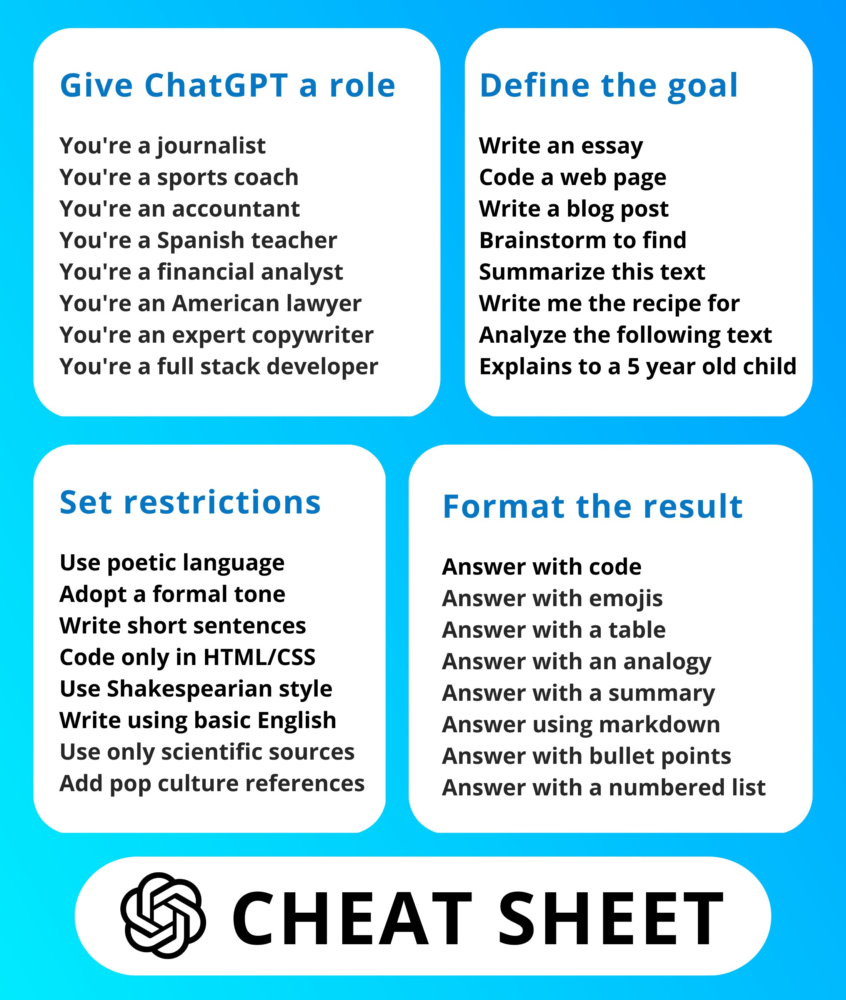

## CSS

### 5 CSS Games for Frontend Developers 4/28/23
1. Flexbox Froggy flexboxfroggy.com
2. CSS Dinner flukeout.github.io
3. Code Monkey http://codemonkey.com
4. Hex Invaders hexinvaders.com
5. CSSBattle cssbattle.dev

## ChatGPT
 
.AutoGPT
AUTOGPT NEW 'AI' Takes the Industry By STORM! (8 New CAPABILITIES)
https://www.youtube.com/watch?v=F9UyTIeaT4o
  

## Tools
<figure>
  <figcatpion>Best startup tools</figcaption>
  
  </figure>
